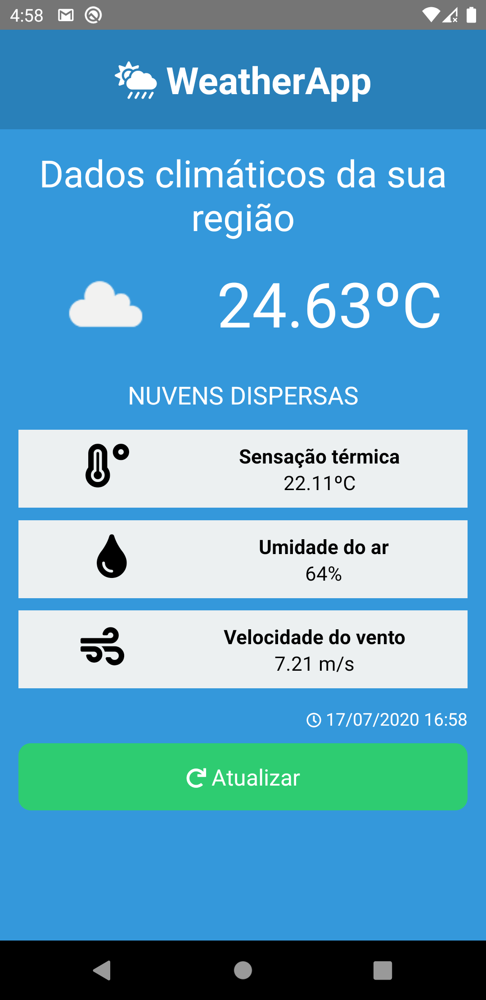

# Weather APP

Aplicativo para exibir informações sobre o tempo na região na qual o dispositivo se encontra.

Para isso utiliza as coordenadas _(é necessário permissão para acessar a localização do usuário)_, com esses dados é possível fazer uma requisição a [OpenWeather](https://openweathermap.org/api) para recuperar os dados do tempo atual.



## Instalação e configuração

A instalação e configuração do app é muito simples.

```shell
# Clone o projeto
$ git clone https://github.com/juakacc/weather-app.git
$ cd weather-app
```

```shell
# Instale as dependências
$ npm i
```

Renomeie o arquivo `example.config.js` para `config.js`. Preencha o valor para a sua `API_KEY`, registrado no site: [OpenWeather](https://openweathermap.org/api)
_Pode utilizar essa para um teste_ **rápido**: _96d424a067dcefe8ebf68c859928548c_

Para executar o projeto localmente é necessário ter um _emulador instalado ou um smartphone configurado_ para debug

```shell
# Inicie o servidor
$ npx react-native start
# Execute o projeto
$ npx react-native run-android
```

## Contribuições

Sinta-se a vontade para contribuir. :)
